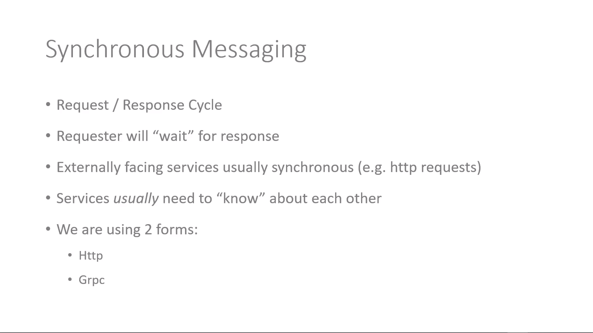

# Dotnet-Microservices-Platforme

Building two .NET Microservices using the GRPC API pattern

Techinacl Asspects of microservices
And please don't demonize the monolith

**Starting with SRP : Single Responsability Principle**

Robert C.Martin : Gather together those things that change for the same reason , and separete those things that changes for different reasons

Benifits : Resilient , Scalable , Increased organizational

That's also called : Event driven architecture

after creating ur application u must build it with docker to do this u craete a Docker file and after u must execute the following command

> docker build -t ayoubkassi/platformservice .

and to run it u use :

> docker run -- 8080:80 -d ayoubkassi/platformservice

push ur image into dockerhub

> docker push ayoubkassi/platformservice

passing now to K8S , we will start by creating deployment for each service

first : create yaml file for ur deployment and after run the command :

> kubectl apply -f platforms-depl.yaml

Usually services needs to know about each other so me as a service i must know that i must go to that exact service and call it , but Usually is in brackets
because there are thing like **Service discovery** and **Service meshes** , that can do this automatic

and yes http is always synchronous , so even when we have the signature of a function with the **async** word but , from a messaging prespective this method will still synchronous , The client still has to wait for a response

async just how the service manage their threads internally , but from client it's always synchronous , client has always to wait for response

Async keyword in C# means just the action will not wait for a long running operation

it will hand back it's thread to thread pool , where it can be reused

### Synchronous messaging between services

-it does tend to pair services , (couple them) and create a dependency

### Asynchronous messaging

-NO request / response cycle
-Requester does not wait
-Event model ,e.g publish-subscribe
-Typically used between services
-Event bus is often used (we'll be using RabbitMQ)
-Services don't need to know about each other, just the bus
